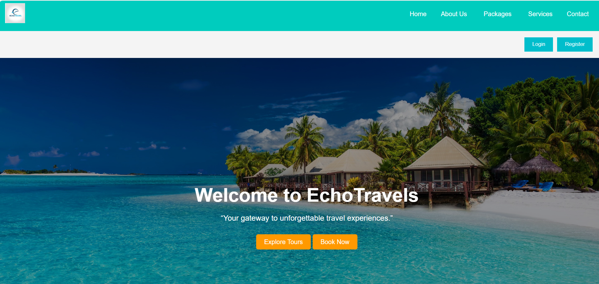
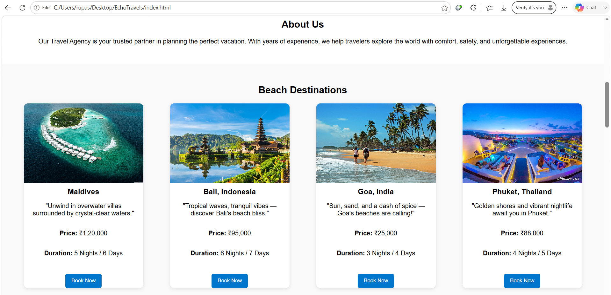
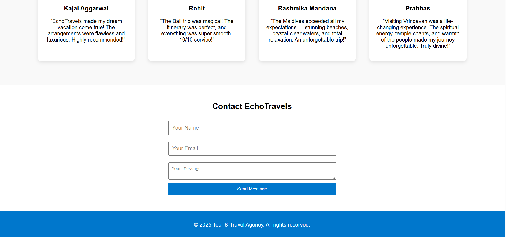
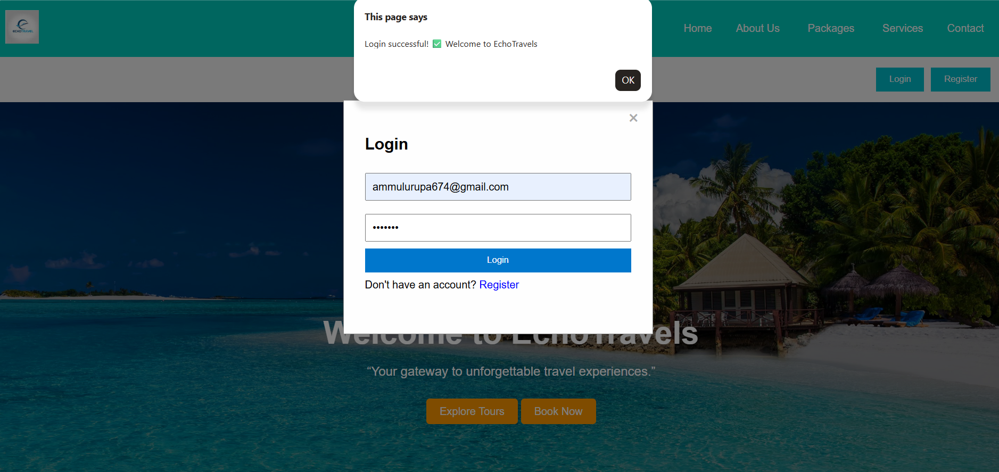

# 🌍 EchoTravels - Tour & Travel Agency Website

<p align="center">


</p>

<p align="center">
A modern, responsive and visually appealing Tour & Travel Agency website built using HTML, CSS and JavaScript.
</p>

---

# ✨ Features

- 🌍 Responsive Travel Website
- 🏖️ Beach, Spiritual & City Tour Packages
- 🔍 Destination Search Bar
- 🎯 Interactive Navigation
- ✈️ Travel Services Section
- ⭐ Customer Testimonials
- 📞 Contact Form
- 🔐 Login & Registration Popup
- 📱 Mobile Friendly Design
- 🎨 Attractive UI & Smooth Animations

---

# 🛠️ Tech Stack

| Technology | Usage |
|------------|-------|
| HTML5 | Website Structure |
| CSS3 | Styling & Responsive Design |
| JavaScript | Dynamic Functionality |
| Git | Version Control |
| GitHub | Repository Hosting |
| GitHub Pages | Live Website Hosting |

---

# 📸 Project Preview

## 🏠 Home Page



---

## 🌴 Tour Packages



---

## ✈️ Services


---

## 📞 Contact Section



---

## 🔐 Login & Registration



---

# 📂 Folder Structure

```text
EchoTravels/
│
├── index.html
├── style.css
├── script.js
├── README.md
├── images/
└── screenshots/
```

---

## 🚀 Live Demo

👉 **[View Live Website](https://rupasribakka.github.io/EchoTravels/)**

## 💻 GitHub Repository

👉 **[View Source Code](https://github.com/rupasribakka/EchoTravels)**

---

# 🚀 Future Enhancements

- Online Booking System
- Payment Gateway Integration
- User Authentication
- Admin Dashboard
- Backend Integration (Node.js & MongoDB)
- Search & Filter Packages
- Booking History
- Wishlist Feature

---

# 👩‍💻 Developed By

**Rupa Sri**

🎓 B.Tech Computer Science & Engineering  
(Cybersecurity, IoT & Blockchain)

---

## 👩‍💻 Connect with Me

[](https://www.linkedin.com/in/rupasri-bakka-524234325/)

[](https://github.com/rupasribakka)

---

⭐ **If you like this project, don't forget to give it a Star!**

---

<p align="center">

⭐ If you like this project, don't forget to Star the repository!

</p>
